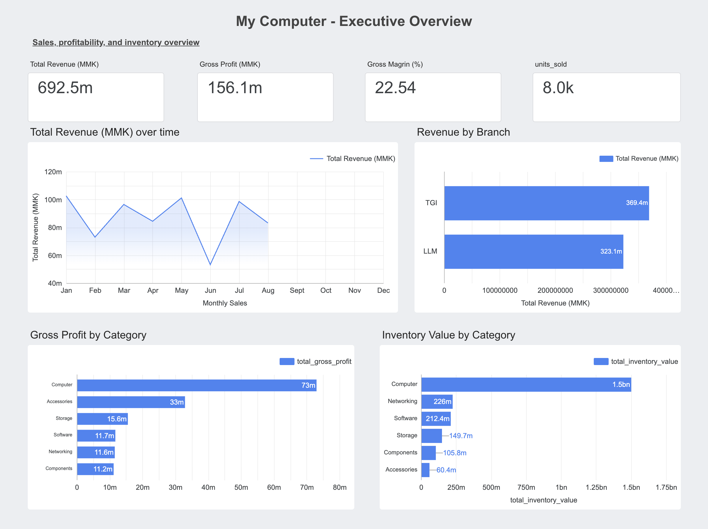
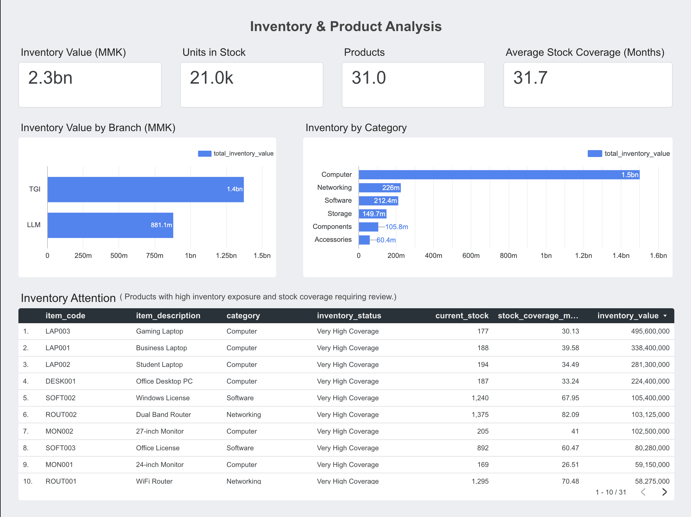
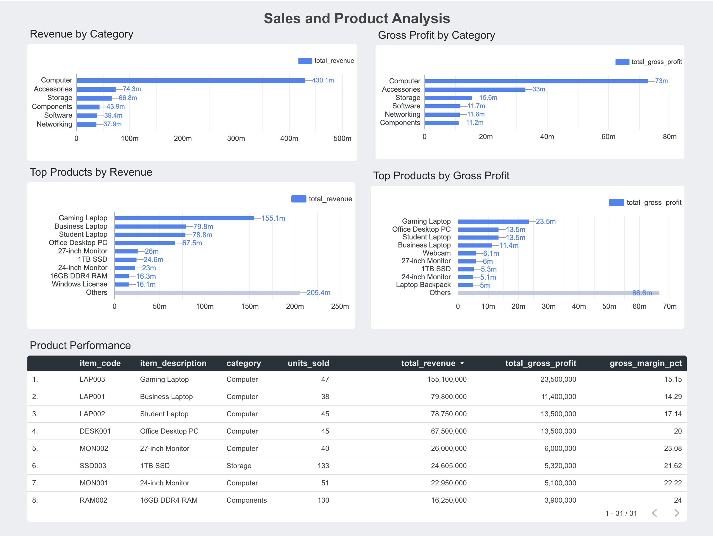

# My Computer Analytics

A business analytics platform developed for a small computer retail and service business to support sales, inventory, purchasing, profitability, and branch-level decision-making.

## Overview

This project was developed for a real small computer retail and service business operating across multiple branches.

The goal is to build a lightweight business analytics platform that transforms operational business data into reliable metrics, interactive dashboards, and actionable insights for management.

The actual project works with the business's operational data. However, because this data is private and commercially sensitive, the public portfolio version uses synthetic data.

The synthetic dataset follows the structure and analytical workflow of the real project while containing no confidential business information. Therefore, the dashboard, SQL analysis, and data pipeline can be demonstrated publicly without exposing the business's actual transactions or performance.

The platform is designed to integrate:

- Product and supplier information
- Purchase transactions
- Sales transactions
- Branch-level inventory
- Pricing and profitability
- Business performance dashboards
- Inventory and sales analysis
- Decision-support insights

## Business Problem

A small retail business operating across multiple branches can accumulate sales, purchasing, and inventory information across different operational sources.

Without a centralized analytics workflow, it can be difficult to answer questions such as:

- How much revenue is being generated?
- How much gross profit is being generated?
- Which branches generate the most sales?
- Which product categories contribute the most revenue and profit?
- Which products generate the most gross profit?
- How much capital is tied up in inventory?
- Which products have high inventory coverage?
- How does product performance differ across branches?

This project addresses these questions by creating a centralized workflow that transforms operational data into business metrics and management dashboards.

## Project Architecture

```text
Operational Business Data
        ↓
     Python ETL
        ↓
   PostgreSQL / Supabase
        ↓
        SQL
        ↓
   Google Data Studio
        ↓
 Management Dashboard
````

## Technology Stack

* **Python** — data generation, transformation, and validation
* **Pandas / NumPy** — data processing
* **PostgreSQL / Supabase** — relational database and source of truth
* **SQL** — analytics and business-performance views
* **Google Data Studio** — interactive business dashboards
* **Git / GitHub** — version control

## Data Model

The current database contains six main tables:

| Table       | Purpose                |
| ----------- | ---------------------- |
| `products`  | Product master data    |
| `suppliers` | Supplier information   |
| `branches`  | Branch information     |
| `purchases` | Purchase transactions  |
| `sales`     | Sales transactions     |
| `inventory` | Branch-level inventory |

The database uses foreign-key relationships to maintain referential integrity between master data, transactions, and inventory.

## Data Pipeline

The project follows an end-to-end data workflow.

### 1. Data Preparation

Python and Pandas are used to prepare and validate the datasets.

For the public portfolio version, synthetic data is generated to represent the structure and characteristics of the business's operational data.

### 2. Data Transformation

Raw datasets are transformed into database-ready formats, including standardized column names, relational identifiers, and consistent data types.

The validated raw data is preserved separately from the processed database-ready data.

### 3. Database Loading

The processed datasets are loaded into PostgreSQL through Supabase.

PostgreSQL acts as the centralized source of truth for the analytics system.

### 4. Analytics Layer

SQL views transform transactional data into business-level metrics and analytical datasets.

### 5. Dashboard

Google Data Studio connects to the PostgreSQL analytics layer and presents the results through management dashboards.

## Dashboard

The project includes an interactive Google Data Studio dashboard covering
executive performance, inventory, sales, and product analysis.

**[View the Live Dashboard →](https://datastudio.google.com/reporting/502615e6-9bfd-4b60-87e2-1b3b6ae9519c)**

### Dashboard Pages

#### Executive Overview



#### Inventory & Product Analysis



#### Sales & Product Analysis



